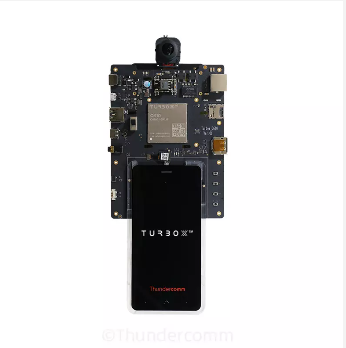
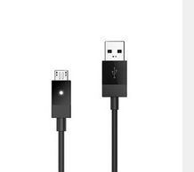
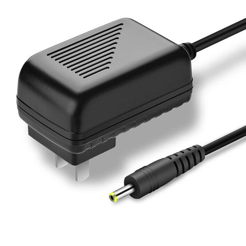
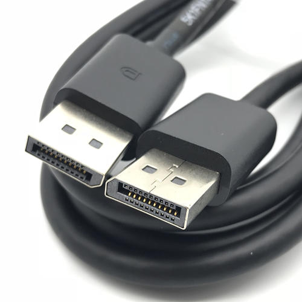
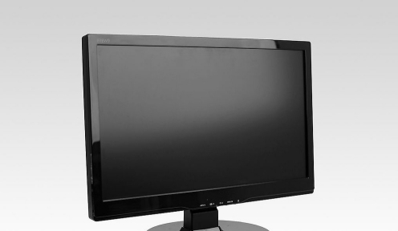

# Qualcomm® QCS610 SoC Open Kit smarttraffic-demo2.0 Developer documentation

## Introduce

This project is based on a open source [EasyPR](https://gitee.com/easypr/EasyPR) and Qualcomm Neural processing SDK for AI.Using the Qualcomm® QCS610 SoC Open Kit and IMX415 camera module. Then,Its powerful computing ability will been show by the license plate recognition process is completed that combine with Qualcomm Neural processing SDK for AI, opencv,SVM and Gstreamer.The EasyPR license plate recognition engine is transplanted to the Qualcomm® QCS610 SoC development board  to display the rich application scenes of Qualcomm® QCS610 SoC.At the same time,UI is developed UI by GTK to display the progress of license plate recognition.

The project was built in x86 host with across complier tool and has been tested in Qualcomm® QCS610 SoC device.

<center>Qualcomm® QCS610 SoC Development board</center>



## Materials and Tools used for the project

1. Hardware materials

Except for the development board,The following hardware materials are also needed:

* Type-C usb line

using the usb line to develop on Qualcomm® QCS610 SoC development board.



* Charger

Direct power supply for Qualcomm® QCS610 SoC development board



* DP-Line

using the universal dp line to connect LED displayer to  Qualcomm® QCS610 SoC development board.



* LED-Displayer

using a LED Displayer to display the smarttraffic-demo2.0 interface from Qualcomm® QCS610 SoC development board.



## Environment configuration

### Qualcomm Neural processing SDK for AI

1. Download the Neural Processing SDK from here:
   [https://developer.qualcomm.com/software/qualcomm-neural-processing-sdk](https://developer.qualcomm.com/software/qualcomm-neural-processing-sdk)
2. Git clone this project link [https://github.com/ThunderSoft-XA/C610-smarttraffic-demo2.0/](https://github.com/ThunderSoft-XA/C610-smarttraffic-demo2.0/)
3. Move the Neural Processing SDK contents to <C610-smarttraffic-demo2.0/snpe/include/zdl>

### GTK-3.0+

The demo`s UI interface based on GTK with dependence library.For example,cario,glib,pango,etc.So,you need install it in progress of host development if you want to program it again,as follow:

```
1. install gcc/g++/gdb/make etc basic compile tools :
     sudo apt-get install build-essential
2. install GTK+3.0：
     sudo apt-get install libgtk-3-dev
3. install pkg-config：
     sudo apt-get install pkg-config
4. install help files：
     sudo apt-get install devhelp
5. check version of pkg-config/gtk+:
     pkg-config -–version 
     pkg-config -–modversion gtk+-3.0
```

## Compile

The compilation of the whole project is based on the yocto compilation tool, so you need to write some .bb and .conf files according to the specification. The link is [traffic_0.1.bb](https://github.com/ThunderSoft-XA/C610-smarttraffic-demo2.0/blob/master/smarttraffic-demo2.0/traffic_0.1.bb) example.

Please refer to [the official Manual of Yocto](https://www.yoctoproject.org) for how to add layers,write layer.conf .Then,excute the command as follows:

```
bitbake smarttraffic-demo2.0
```

you will get a  executable bin file named smarttraffic-demo2.0.Move it to the root of the source code.Next,push the whole project code to Qualcomm® QCS610 SoC device`s dir /data/.

```
adb root && adb disable-verity && adb reboot

adb root &&adb remount && adb shell mount -o remount,rw /

adb push xxx/xxx/sourcepath /data

adb shell

cd data/smarttraffic-demo2.0
```

## Configure Weston and Usage

### 1. Configure Weston

To Download *Turbox-C610-aarch64_AI_Demo_Firmware.tgz*, go to: TBU

Push the *firmware package* to target device's */data/* directory.

```
$ adb root
$ adb disable-verity && adb reboot
$ adb root && adb shell mount -o remount,rw /
$ adb push Turbox-C610-aarch64_AI_Demo_Firmware.tgz  /data/
$ adb shell
$ tar -zxvf /data/ Turbox-C610-aarch64_AI_Demo_Firmware.tgz  -C /data/
```

Unpack *Turbox-C610-aarch64_Weston_DP_Firmware.tgz* under root directory to enable weston output to DP.

```
$ tar -zxvf /data/ Turbox-C610-aarch64_AI_Demo_Firmware/aarch64-weston-dp.tgz -C /
```

### 2. Usage

This project only provides a simple command line interface.

run smarttraffic-demo2.0：

Run the **smarttraffic-demo2.0** app.the demo video will play on the DP screen.

[weston_dp_client script](https://github.com/ThunderSoft-XA/C610-smarttraffic-demo2.0/blob/master/smarttraffic-demo2.0/weston_dp_client)

```

$ cd /data/<source root dir>
$ ./weston_dp_client smarttraffic-demo2.0
```
